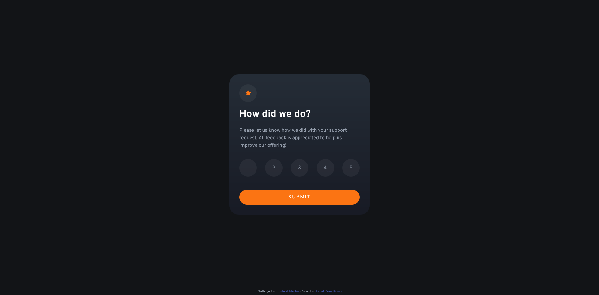

# Frontend Mentor - Interactive rating component solution

This is a solution to the [Interactive rating component challenge on Frontend Mentor](https://www.frontendmentor.io/challenges/interactive-rating-component-koxpeBUmI). Frontend Mentor challenges help you improve your coding skills by building realistic projects. 

## Table of contents

- [Overview](#overview)
  - [The challenge](#the-challenge)
  - [Screenshot](#screenshot)
  - [Links](#links)
- [My process](#my-process)
  - [Built with](#built-with)
  - [What I learned](#what-i-learned)
  - [Continued development](#continued-development)
  - [Useful resources](#useful-resources)
- [Author](#author)

**Note: Delete this note and update the table of contents based on what sections you keep.**

## Overview

### The challenge

Users should be able to:

- View the optimal layout for the app depending on their device's screen size
- See hover states for all interactive elements on the page
- Select and submit a number rating
- See the "Thank you" card state after submitting a rating

### Screenshot



### Links

- Solution URL: [https://www.frontendmentor.io/solutions/interactive-rating-component-PPX2ubXytD](https://www.frontendmentor.io/solutions/interactive-rating-component-PPX2ubXytD)
- Live Site URL: [https://daniel77apr.github.io/Frontend-Mentor-Interactive-rating-component/](https://daniel77apr.github.io/Frontend-Mentor-Interactive-rating-component/)

## My process

### Built with

- Semantic HTML5 markup
- CSS custom properties
- Flexbox

### What I learned

You can customize radio buttons by adding a *display: none* to the input element and adding a sibbling div with the desired styles. To make the divs change according to the state of the radio inputs, use an *element+element* selector, which selects an element that is directly after another specific element.

Example:

```css
.radio:checked + div {
    background-color:var(--medium-grey);
    color: var(--white);
}
```

### Continued development

I am not sure how to use JavaScript to modify elements created with JavaScript using the *innerHTML* method.

### Useful resources

- [Style Radio Buttons with CSS](https://www.youtube.com/watch?v=MZq5zFSpUlo&ab_channel=BeforeSemicolon) - This video helped me customize the radio buttons.
- [CSS element+element Selector](https://www.w3schools.com/cssref/sel_element_pluss.php) - This article taught me about this type of selector, which was useful for styling radio buttons.

## Author

- GitHUb - [Daniel77apr](https://github.com/Daniel77apr)
- Frontend Mentor - [@Daniel77apr](https://www.frontendmentor.io/profile/Daniel77apr)
